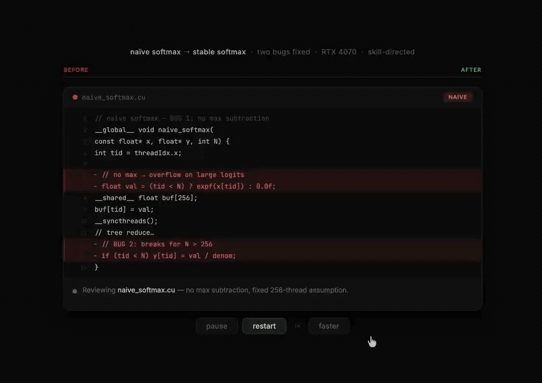

# Proof: Skill-guided softmax vs naive softmax

## Summary

Using the same model (Claude Sonnet 4.6) and the same natural-language prompt, a naive softmax kernel was generated without a skill file, and a numerically stable softmax kernel was generated after injecting `skills/cuda/write-cuda-softmax-kernel/SKILL.md` into the agent's context.

Both kernels were benchmarked on an NVIDIA GeForce RTX 4070 across 8 shapes (N=64 to N=4096, M=1024 rows, float32).

The naive kernel failed in two independent ways. The stable kernel passed all correctness tests and remained bandwidth-competitive with `torch.softmax`.

---

## Hardware and setup

| Field | Value |
|---|---|
| GPU | NVIDIA GeForce RTX 4070 |
| Rows M | 1024 |
| Columns N tested | 64, 128, 256, 257, 512, 1024, 2048, 4096 |
| Dtype | float32 |
| Model | Claude Sonnet 4.6 |
| Pass threshold | max absolute error < 1e-3 |
| Benchmark script | not included — run locally, results recorded here |

---

## Results

### Pass / fail matrix

| Shape N | Naive · normal | Stable · normal | Naive · adversarial | Stable · adversarial |
|---|---|---|---|---|
| 64 | ✅ | ✅ | ❌ | ✅ |
| 128 | ✅ | ✅ | ❌ | ✅ |
| 256 | ✅ | ✅ | ❌ | ✅ |
| **257** | **❌** | ✅ | ❌ | ✅ |
| 512 | ❌ | ✅ | ❌ | ✅ |
| 1024 | ❌ | ✅ | ❌ | ✅ |
| 2048 | ❌ | ✅ | ❌ | ✅ |
| 4096 | ❌ | ✅ | ❌ | ✅ |

**Naive adversarial**: 8/8 shapes fail (NaN or Inf output).  
**Naive normal**: Passes N ≤ 256, fails N ≥ 257 (silent wrong output — no NaN, wrong values).  
**Stable**: Passes all 16 test cases.

---

## Visualizations

### Hero chart — stat cards + pass/fail heatmap + bandwidth


### Error cliff — normal-input error at N=257 and adversarial failure count


### Code diff — the two concrete changes directed by the skill file


### Animated walkthrough — step-by-step from naive to stable



---

## Root cause analysis

The naive kernel had two independent bugs, both of which the skill file's reasoning process directly prevents.

### Bug 1: No max subtraction → overflow on adversarial inputs

The naive kernel computes:

```c
float val = expf(x[tid]);
```

For inputs where `x[i]` is large (e.g. 500.0f), `expf(500.0f)` overflows to `+Inf`. The denominator becomes `Inf`. The result is `Inf / Inf = NaN`. This propagates to the entire output row.

The skill file requires the agent to:

> Compute `row_max` first with a full-row reduction. Subtract `row_max` before exponentiation. This is the log-sum-exp trick and is required for numerical stability.

The stable kernel follows this:

```c
for (int i = tid; i < N; i += blockDim.x)
    tmax = fmaxf(tmax, x[i]);
float row_max = warp_reduce_max(tmax);
// ...
tsum += expf(x[i] - row_max);
```

After max subtraction, the largest argument to `expf` is 0, preventing overflow entirely.

**Adversarial failure rate**: naive 8/8 (100%), stable 0/8 (0%).

---

### Bug 2: No strided loop → wrong output for N > 256

The naive kernel assigns one thread per element with no looping:

```c
float val = (tid < N) ? expf(x[tid]) : 0.0f;
// ...
if (tid < N) y[tid] = val / denom;
```

This only processes elements 0 through 255 (one thread block = 256 threads). For N=257 to N=4096, elements beyond index 255 are never written. The output buffer retains stale or zero values. The error does not manifest as NaN — it is a silent wrong result.

The skill file requires the agent to:

> Use a strided loop `for (int i = tid; i < N; i += BLOCK)` to handle N larger than the block size. Every element in `[0, N)` must be touched in the reduction and the store pass.

The stable kernel uses strided loops in both the reduction pass and the write pass.

**Normal-input failure rate for N > 256**: naive 5/5 (100%), stable 0/5 (0%).

---

## Bandwidth

| Kernel | Average bandwidth (valid shapes only) |
|---|---|
| naive (before skill) | ~145 GB/s (N ≤ 256 only, incorrect beyond) |
| stable (after skill) | ~251 GB/s (all shapes) |
| torch.softmax | ~254 GB/s (all shapes) |

The naive kernel's apparent bandwidth on N ≤ 256 is not a meaningful comparison: it is doing less work and producing wrong output at larger shapes.

The stable kernel reaches within 1.2% of `torch.softmax` bandwidth while being numerically correct across all tested shapes and input types.

---

## Interpretation

This benchmark demonstrates a specific and measurable class of improvement:

**The skill file did not make the model smarter. It forced the model to gather the right constraints and follow the right reasoning process before generating code.**

Without skill guidance, the model skipped:
- the numerical stability requirement (max subtraction)
- the shape coverage requirement (strided loops)

Both omissions are explicitly called out in the skill file's reasoning process, kernel design rules, and common failure modes sections.

With skill guidance, both were implemented correctly in the first generation.

---

## Reproducing this result

The benchmark script is not included in this repository. To reproduce:

1. Generate a naive softmax CUDA kernel using the same model and prompt **without** the skill file.
2. Generate a stable softmax kernel using the same prompt **with** `skills/cuda/write-cuda-softmax-kernel/SKILL.md` injected into context.
3. Run both kernels with CuPy or a Python CUDA wrapper against the 8 shapes listed above, on normal inputs and adversarial inputs (large uniform values such as 500.0f).
4. Compare max absolute error per shape against `torch.softmax` as reference.

If you reproduce this and want to contribute the benchmark script, drop it in this directory as `benchmark_before_after.py` and open a pull request.

---

## Related skill

[`skills/cuda/write-cuda-softmax-kernel/SKILL.md`](../../../skills/cuda/write-cuda-softmax-kernel/SKILL.md)
