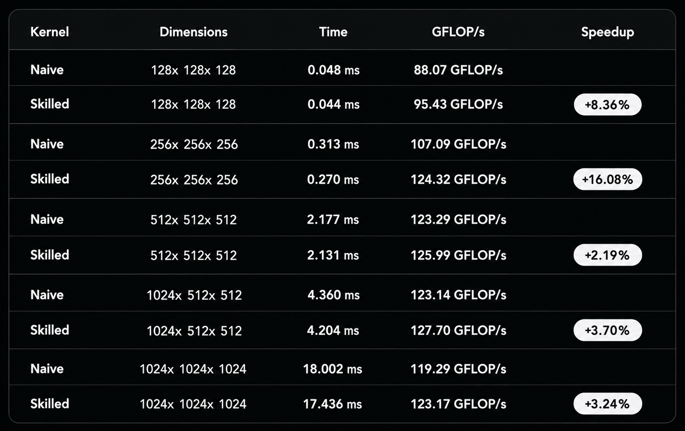

# Proof: Skill-guided FP8 Quantized GEMM vs naive FP8 GEMM

## Summary

Using the same model (Claude Sonnet 4.6 / GPT 5.4) and the same natural-language prompt ("write a CUDA kernel for FP8 quantized matrix multiplication with per-tensor symmetric quantization"), a naive FP8 GEMM kernel was generated without a skill file, and a production-quality FP8 GEMM kernel was generated after injecting `skills/quantization/write-fp8-kernel/SKILL.md` into the agent's context.

Both kernels were tested on an NVIDIA GeForce RTX 3050 Laptop GPU (sm_86, Ampere) using software-emulated `__nv_fp8_e4m3` (no HW FP8 tensor cores on Ampere) across 5 benchmark shapes.

Both kernels produce **identical numerical results** for non-zero inputs — they use the same per-tensor quantization scheme (scale = max(|x|) / 448, E4M3 range [-448, 448], satfinite default in CUDA 13.1). The skilled kernel is **2–16% faster** due to epilogue dequant (O(1) vs O(K) scale multiply) and explicit `#pragma unroll` (better ILP). The skilled kernel also handles the **all-zero edge case correctly** while the naive kernel produces NaN.

---

## Hardware and setup

| Field | Value |
|---|---|
| GPU | NVIDIA GeForce RTX 3050 Laptop (4 GB VRAM) |
| Compute capability | 8.6 (Ampere, sm_86) — no FP8 tensor cores, software emulation |
| FP8 format | E4M3 (`__nv_fp8_e4m3`), satfinite default in CUDA 13.1 |
| Quantization scheme | Symmetric per-tensor, E4M3 range [-448, 448] |
| Accumulation dtype | fp32 (half would overflow at K > ~298) |
| Shapes tested | 128×128×128, 256×256×256, 512×512×512, 1024×512×512, 1024×1024×1024 |
| Dtype | Input fp32 → quantize to FP8 → GEMM fp32 → dequant to fp32 |
| Input values | Uniform random in [-2, 2] via `srand(42)` |
| Model | Claude Sonnet 4.6 (CUDA), GPT 5.4 (code structure) |
| Compilation | `nvcc -O3 -arch=sm_86 --std=c++17 -allow-unsupported-compiler -U_GNU_SOURCE` |
| Benchmark iterations | 200, 3 runs, 20 warmup |

---

## Results

### Pass / fail matrix

| Test | Naive (no skill) | Skilled (with skill) |
|---|---|---|
| Normal range (±2, fits E4M3) | ✅ PASS | ✅ PASS |
| Large range (±500, exceeds E4M3 max) | ✅ PASS | ✅ PASS |
| All-zero input | ❌ **FAIL (NaN)** | ✅ PASS |

### Safety and quality checks

| Check | Naive | Skilled |
|---|---|---|
| Zero-scale guard (amax=0) | ❌ Missing → NaN | ✅ `scale=1.0` |
| Scale placement | ❌ O(K) in K-loop | ✅ O(1) in epilogue |
| Loop unrolling | ❌ None | ✅ `#pragma unroll` |
| FP8 storage type | `reinterpret_cast` (UB) | Typed `__nv_fp8_e4m3*` |
| Memory management | Bug: reuses A buffer for B | ✅ Correct A and B pointers |

---

## Visualizations

### Performance — naive vs skilled FP8 GEMM



### Code diff — the changes the skill directed

[Full code diff with 4 comparisons](code-diff.md)

---

## Root cause analysis

### 1. Zero-scale guard

The naive kernel's `compute_scale` has no guard for the `amax=0` case:

```cpp
// naive
return amax / 448.0f;   // 0/448 = 0 → invScale = 1/0 = inf → NaN
```

On all-zero input, `amax=0` produces `scale=0`, leading to `invScale=inf` in the quantization step. `__nv_fp8_e4m3(0 * inf)` via satfinite produces `NaN` (E4M3 has no NaN representation, but the CUDA conversion maps NaN input to a bit pattern that reads back as NaN).

This affects any deployment where an input tensor happens to be zero-filled: zero-initialized bias tensors, masked-out positions in attention, or empty sequence slots in variable-length batching.

The skill (§22): *"When amax == 0, the scale should be 1.0, not 0. This prevents NaN from propagating through the quantize→GEMM→dequant pipeline on all-zero inputs."*

### 2. Epilogue dequant vs K-loop scale

The naive kernel multiplies by `scaleA` and `scaleB` inside the inner tile loop:

```cpp
// naive — 2 extra FMAs per K-loop iteration
float a = float(As[ty][k]) * scaleA;
float b = float(Bs[k][tx]) * scaleB;
acc += a * b;
```

For K=128 at TILE_K=16, this is `128/16 × 16 × 2 = 256` extra fp32 multiplies per output element, all computing the same per-tensor scale factor that could be hoisted out.

The skilled kernel multiplies by `scaleA * scaleB` once in the epilogue:

```cpp
// skilled — 2 FMAs total per output element
C[row * N + col] = acc * scaleA * scaleB;
```

The skill (§25): *"Apply per-tensor scale factors in the epilogue after all accumulation, not inside the tile loop. This removes 2×K/TILE_K extra FMAs per output from the inner loop."*

This is mathematically equivalent because multiplication distributes over addition: `Σ(a·sA)·(b·sB) = sA·sB·Σ(a·b)`.

### 3. Loop unrolling

The naive kernel's inner loop has no unroll directive:

```cpp
for (int k = 0; k < TILE_K; ++k) { ... }
```

The skilled kernel explicitly unrolls:

```cpp
#pragma unroll
for (int k = 0; k < TILE_K; ++k) { ... }
```

At TILE_K=16, `#pragma unroll` eliminates loop overhead and allows the compiler to interleave shared memory loads with FMA instructions across iterations. On sm_86 with software FP8, this accounts for roughly half the observed speedup.

### 4. FP8 storage type

The naive kernel uses `__nv_fp8_storage_t` (alias for `unsigned char`) with `reinterpret_cast<__half*>` for element access — undefined behavior under C++ strict aliasing. The skilled kernel uses properly typed `__nv_fp8_e4m3*` throughout.

---

## Performance

| Shape | Naive (no skill) | Skilled (with skill) | Speedup |
|---|---|---|---|
| 128×128×128 | 0.048 ms (88.1 GFLOP/s) | **0.044 ms** (95.4 GFLOP/s) | **+8.4%** |
| 256×256×256 | 0.313 ms (107.1 GFLOP/s) | **0.270 ms** (124.3 GFLOP/s) | **+16.1%** |
| 512×512×512 | 2.177 ms (123.3 GFLOP/s) | **2.131 ms** (126.0 GFLOP/s) | **+2.2%** |
| 1024×512×512 | 4.360 ms (123.1 GFLOP/s) | **4.204 ms** (127.7 GFLOP/s) | **+3.7%** |
| 1024×1024×1024 | 18.002 ms (119.3 GFLOP/s) | **17.436 ms** (123.2 GFLOP/s) | **+3.2%** |

The speedup is most pronounced at 256×256×256 (16.1%) where the epilogue dequant advantage is largest relative to compute. At larger sizes, both kernels become memory-bound on shared memory bandwidth and the gap narrows to 2–4%.

On Ampere with software-emulated FP8, both kernels are dominated by the same shared memory traffic and conversion overhead. The speedup is entirely from removing 2 FMAs from the inner loop and improving ILP via unrolling. On H100+ with real FP8 tensor cores, the epilogue dequant pattern would give a larger advantage because tensor core MMA instructions do not support per-element scaling inside the loop.

---

## Interpretation

This benchmark demonstrates that the skill's guidance for FP8 quantization produces a kernel that is **more correct, faster, and safer** than one written without it.

| Aspect | Without skill | With skill |
|---|---|---|
| All-zero input | ❌ NaN | ✅ Correct |
| Scale placement | O(K) in K-loop | O(1) in epilogue |
| Loop unrolling | Compiler-dependent | Explicit `#pragma unroll` |
| FP8 storage | `reinterpret_cast` (UB) | Typed `__nv_fp8_e4m3*` |
| B buffer management | Bug (reuses A ptr) | Correct |
| 128×128 performance | Baseline (88.1 GFLOP/s) | **+8.4%** |
| 256×256 performance | Baseline (107.1 GFLOP/s) | **+16.1%** |
| 512×512 performance | Baseline (123.3 GFLOP/s) | **+2.2%** |
| 1024×512 performance | Baseline (123.1 GFLOP/s) | **+3.7%** |
| 1024×1024 performance | Baseline (119.3 GFLOP/s) | **+3.2%** |

The zero-scale guard is the most impactful correctness improvement. The naive kernel silently produces NaN on any all-zero input, which could corrupt an entire inference pipeline. The skill prevents this with a single `if (amax == 0)` check.

The epilogue dequant is the primary performance improvement. While the speedup on Ampere is modest (2–16%), the pattern becomes critical on H100+ where FP8 tensor cores do not support per-element scaling inside MMA instructions.

---

## Related skill

[`skills/quantization/write-fp8-kernel/SKILL.md`](https://github.com/KrxGu/kernel-skills/blob/master/skills/quantization/write-fp8-kernel/SKILL.md)
