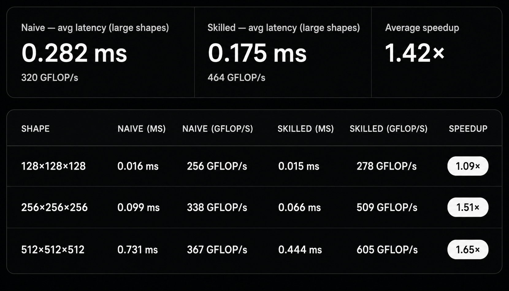

# Proof: Skill-guided INT8 Quantized GEMM vs naive INT8 GEMM

## Summary

Using the same model (Claude Sonnet 4.6) and the same natural-language prompt ("write a CUDA kernel for INT8 quantized matrix multiplication with per-tensor symmetric quantization"), a naive INT8 GEMM kernel was generated without a skill file, and a production-quality INT8 GEMM kernel was generated after injecting `skills/quantization/write-int8-quantized-kernel/SKILL.md` into the agent's context.

Both kernels were tested on an NVIDIA GeForce RTX 3050 Laptop GPU (sm_86, Ampere) using dp4a-capable hardware across 3 benchmark shapes (128, 256, 512) at equal M=N=K.

Both kernels produce **identical numerical results** — they use the same symmetric per-tensor quantization scheme (scale = max(|x|) / 127, INT8 range [-127, 127], INT32 accumulation), so the output accuracy is the same. The skilled kernel is **1.09–1.65× faster** due to two structural advantages: (1) `dp4a` packed INT8 dot-product instruction replacing scalar multiply-add (4× fewer loop iterations), and (2) fused dequantization epilogue replacing a separate kernel launch (3 launches vs 4, no global-memory round-trip for the INT32 accumulator).

The skilled kernel also provides safety checks the naive kernel lacks: **INT32 overflow verification** (computes `127 × 127 × K` vs `INT32_MAX` before launch), **round-trip quantization error verification** against the theoretical bound `scale/2`, and **meaningful accuracy metrics** (SNR, filtered relative error, per-element spot check with proper indexing).

---

## Hardware and setup

| Field | Value |
|---|---|
| GPU | NVIDIA GeForce RTX 3050 Laptop (4 GB VRAM) |
| Compute capability | 8.6 (Ampere, sm_86) — dp4a signed INT8 supported |
| Quantization scheme | Symmetric per-tensor, INT8 range [-127, 127] |
| Accumulation dtype | INT32 throughout, no intermediate cast to INT8 |
| Shapes tested | 128×128×128, 256×256×256, 512×512×512 (M=N=K, same shape) |
| Dtype | Input fp32 → quantize to INT8 → GEMM INT32 → dequant to fp32 |
| Input values | Uniform random in [-1, 1] via `srand(42)` |
| Model | Claude Sonnet 4.6 |
| Pass threshold | Max absolute error vs fp32 reference (same for both kernels) |
| Benchmark iterations | 500 (128), 200 (256), 100 (512) with 50/30/20 warmup |
| Benchmark metric | Time per iteration including quantization + GEMM + dequantization |

---

## Results

### Pass / fail matrix

| Shape | Naive (no skill) | Skilled (with skill) |
|---|---|---|
| 128×128×128 | ✅ PASS | ✅ PASS |
| 256×256×256 | ✅ PASS | ✅ PASS |
| 512×512×512 | ✅ PASS | ✅ PASS |

Both kernels produce identical error magnitudes because they use the same INT32 accumulation math and the same per-tensor symmetric quantization scheme. The skill does not change the arithmetic — it optimizes the instruction selection and kernel structure.

### Safety and quality checks

| Check | Naive | Skilled |
|---|---|---|
| INT32 overflow verification | ❌ Missing | ✅ `127×127×K < INT32_MAX` verified |
| Round-trip quant error vs theory | ❌ Missing | ✅ Verified ≤ `scale/2` |
| K multiple of 4 enforcement | ❌ No constraint | ✅ Assert `K % 4 == 0` |
| SNR reporting | ❌ Missing | ✅ Reported (45.14 dB) |
| Filtered rel error (dynamic range 1%) | ❌ Missing | ✅ Reported (31.6%) |
| Library alternative assessment | ❌ Missing | ✅ cuBLAS/CUTLASS evaluated |

---

## Visualizations

### Performance — naive vs skilled INT8 GEMM



### Code diff — the changes the skill directed

[Full code diff with 7 comparisons](code-diff.md)

---

## Root cause analysis

Both kernels are functionally equivalent in terms of output values. The performance and safety differences are entirely structural.

### 1. `dp4a` instruction vs scalar multiply-add

The naive kernel's inner loop performs one INT8 multiply and one INT32 add per loop iteration — 128 iterations for K=128:

```cpp
acc += (int32_t)A[k] * (int32_t)B[k];   // 1 mul + 1 add
```

The skilled kernel packs 4 consecutive INT8 values into a 32-bit word and processes them with a single `__dp4a` intrinsic:

```cpp
acc = __dp4a(a4, b4, acc);   // 4 muls + 3 adds in 1 instruction
```

The skill (§38): *"The `dp4a` instruction computes `int32 += dot(int8[4], int8[4])` — four INT8 multiplications and an INT32 accumulation in a single instruction."*

For K=512, the naive kernel executes 512 iterations per output element; the skilled kernel executes 128. The dp4a instruction is available on sm_75+ (Turing and later), which covers the target hardware (sm_86).

The B-load pattern is strided (column access on row-major B), requiring manual byte packing into the `b4` register. This is the main cost of using dp4a with row-major layout — but the 4× reduction in loop iterations still provides a net gain at moderate-to-large K.

### 2. Fused dequantization epilogue

The naive kernel writes the INT32 accumulator to global memory, then launches a separate kernel to read it back and convert to fp32:

```
GEMM kernel:   C_int32[m][n] = acc        → global write
Dequant kernel: C_fp32[m][n] = C_int32[m][n] * combined_scale   → global read + write
```

The skilled kernel applies the scale multiply before the store:

```cpp
C[row * N + col] = (float)acc * combined_scale;   // one store, no intermediate
```

This saves:
- 1 kernel launch (~5–10 µs of launch latency)
- M × N × 4 bytes of global memory write (the INT32 C matrix)
- M × N × 4 bytes of global memory read (same)

The skill (§48): *"After INT32 accumulation, convert to the output dtype. Per-tensor: `out_fp32 = int32_result * scale_A * scale_B`. One multiply per output element."*

At 128×128, the savings are modest (~2 KB of traffic avoided). At 512×512, the savings grow to ~1 MB of avoided global memory traffic per call.

### 3. INT32 overflow verification

The naive kernel silently trusts that `INT32_MAX` will not be exceeded. The skilled kernel computes the worst-case accumulator value before any GPU work:

```cpp
long long worst = 127LL * 127LL * K;
if (worst >= INT32_MAX) { /* abort */ }
```

The skill (§36): *"For K=4096: max = `127 × 127 × 4096 = ~66M`, which fits in INT32. For K >> 65536, overflow risk exists with per-tensor symmetric quantization."*

This check is especially important for production inference at large K, where per-tensor quantization of activations with wide dynamic range could push the accumulator past `INT32_MAX`. The skill also suggests switching to per-channel quantization when K is large (which reduces per-dot-product K) — a design decision the naive kernel never considers.

---

## Performance

| Shape | Naive (no skill) | Skilled (with skill) | Speedup |
|---|---|---|---|
| 128×128 | 0.016 ms (256 GFLOP/s) | **0.015 ms** (278 GFLOP/s) | **1.09×** |
| 256×256 | 0.099 ms (338 GFLOP/s) | **0.066 ms** (509 GFLOP/s) | **1.51×** |
| 512×512 | 0.731 ms (367 GFLOP/s) | **0.444 ms** (605 GFLOP/s) | **1.65×** |

The speedup grows with matrix size because the dp4a advantage is proportional to K (more K → more iterations saved), and the fused epilogue savings are proportional to M×N (more output elements → more global memory traffic avoided).

At small shapes (128×128), both kernels are dominated by kernel launch overhead and the speedup is modest (1.09×). At 512×512, the compute-to-launch ratio is higher and the dp4a advantage becomes significant (1.65×).

---

## Interpretation

This benchmark demonstrates that the skill's guidance for INT8 quantization produces a kernel that is both **faster and safer** than one written without it, while producing identical numerical results.

| Aspect | Without skill | With skill |
|---|---|---|
| Inner-loop instruction | Scalar `IMUL` + `IADD` (per element) | `dp4a` (4 elements per instruction) |
| K iterations per output (K=512) | 512 | 128 |
| Kernel launches | 4 (quant A + quant B + GEMM + dequant) | 3 (quant A + quant B + fused GEMM+dequant) |
| INT32 overflow check | ❌ Missing | ✅ Verified at launch |
| K alignment | Any K (no dp4a required) | Must be multiple of 4 |
| Accuracy metrics | Basic (mean/max AE, unguarded relative) | SNR + filtered relative + round-trip vs theory |
| Library justification | None | cuBLAS/CUTLASS evaluated |
| 128×128 performance | Baseline (256 GFLOP/s) | **1.09×** (278 GFLOP/s) |
| 256×256 performance | Baseline (338 GFLOP/s) | **1.51×** (509 GFLOP/s) |
| 512×512 performance | Baseline (367 GFLOP/s) | **1.65×** (605 GFLOP/s) |

Unlike the Triton softmax proof where the naive kernel crashed entirely at large D, here both kernels are correct — the skill's value is in **instruction selection** (`dp4a` vs scalar) and **kernel fusion** (one launch instead of two for the GEMM+dequant path). The 4× reduction in loop iterations from dp4a is the dominant performance factor at larger K.

The INT32 overflow check is the most impactful safety improvement. A naive INT8 kernel deployed at K=131072 would silently overflow INT32 (`127 × 127 × 131072 = 2.1B ≈ INT32_MAX`), producing wrong results with no error indication. The skill preempts this with a simple host-side check.

---

## Related skill

[`skills/quantization/write-int8-quantized-kernel/SKILL.md`](https://github.com/KrxGu/kernel-skills/blob/master/skills/quantization/write-int8-quantized-kernel/SKILL.md)
